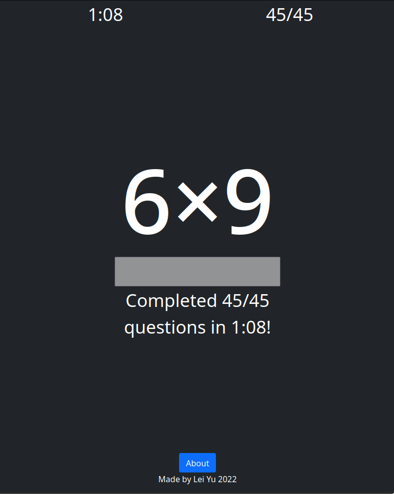

# Math Racer
#### Video Demo: https://youtu.be/1Nu3nuLOxbg
#### Description: 

A web app developed to help grade schoolers practice the multiplication table.

# Features
- Automatically generate questions from the multiplication table from 1 to 9 (45 questions in total)
- At the end will give feed back on the time and number of questions answered correctly
- An about module that gives short description of what the web app does.
- Mobile Friendly

# Description of Each Part of Project

#### index.html
This contain the html of the webpage. It contains the meta data to use Bootstrap, and sources the css and js file from its directory.

#### style.css
This contain the more specific styling that was not covered by Bootstrap. 

#### index.js
This file contains the game logic including timer, question generation, and answer checking.

Also includes updating the webpage with the correct number of question answered, updating the timer, giving feedback at the end.

# Why this was developed

Multiplication is such an fundamental concept in mathematic that being able to multiply fast and accurately will help with student to grasp harder concepts.

There are many math concept where an deep understanding of the multiplication table will help student solve questions faster and with less cognitive load.

Among these concepts are: Factoring, identifying and naming perfect squares, arithmetics, division, distribution.

The most common way to become faster and more accurate with multiplication is to memorize it through route learning. Since it is just way better to be able to know the multiplication table by heart instead of doing mental math every time. The web app was developed to test how fast and how accurate one is able to go through the multiplication table.

Lastly, this is also just a fun way for anyone to practice and test how good they are with the multiplication table.

***Try to Get Sub 1 Minute!***

# What Was Used to Develop This
Developed using HTML, CSS, Bootstrap, and Javascript.

Music: https://www.bensound.com
